# 🛒 Global Superstore Sales Analysis

> Phân tích toàn diện hoạt động kinh doanh bán lẻ toàn cầu giai đoạn 2011–2014  
> sử dụng **SQL · Python · Power BI** — End-to-End Data Analytics Portfolio Project


---

## 📌 Giới thiệu dự án

Dự án phân tích bộ dữ liệu thực tế từ **Global Superstore** — chuỗi siêu thị bán lẻ toàn cầu có trụ sở tại New York — với hơn **51,290 đơn hàng** trải dài **147 quốc gia** trong giai đoạn 2011–2014.

**Câu hỏi kinh doanh trọng tâm:**
> *"Tại sao một số danh mục sản phẩm có doanh thu cao nhưng thực tế đang thua lỗ? Đâu là nguyên nhân gốc rễ và giải pháp data-driven nào có thể cải thiện lợi nhuận?"*

Dự án thực hiện theo **quy trình DA thực tế trong doanh nghiệp**: SQL → Python → Power BI liên thông, không phải 3 phần rời nhau.

---

## 📊 Dataset

- **Nguồn:** [Kaggle — Global Superstore Dataset](https://www.kaggle.com/datasets/apoorvaappz/global-super-store-dataset)
- **Thời gian:** 01/01/2011 – 31/12/2014
- **Quy mô:** 51,290 đơn hàng · 147 quốc gia · 1,590 khách hàng · 10,292 sản phẩm
- **File gốc:** `Global_Superstore2.xlsx` (Sheet1 — 24 cột)

---

## 🎯 Mục tiêu phân tích

| # | Mục tiêu | Phase | Xem phân tích |
|---|---|---|---|
| 1 | Phân tích xu hướng doanh thu theo thời gian (2011–2014) | Python | Chart 02 — Monthly Trend |
| 2 | Xác định danh mục & sub-category có lợi nhuận cao/thấp nhất | SQL + Python | Chart 03 — Margin |
| 3 | Chứng minh tác động của Discount lên Profit bằng số liệu | Python | Chart 07–10 |
| 4 | Phân khúc khách hàng theo RFM — xác định Champions vs At Risk | Python | Chart 11–14 |
| 5 | Phân tích địa lý — thị trường nào sinh lợi, thị trường nào thua lỗ | Python | Chart 15–18 |
| 6 | Dự báo doanh thu H1 2015 từ pattern 4 năm lịch sử | Python | Chart 19–20 |
| 7 | Xây dựng dashboard 5 trang phục vụ ra quyết định kinh doanh | Power BI | Dashboard |

---

## 🛠️ Công cụ & Thư viện

| Công cụ | Version | Mục đích |
|---|---|---|
| Python | 3.10 | Xử lý và phân tích dữ liệu |
| Pandas | 2.0 | Load, merge, làm sạch, transform dữ liệu |
| NumPy | 1.24 | Tính toán số học, tạo arrays |
| Matplotlib | 3.7 | Vẽ biểu đồ cơ bản (bar, line, scatter) |
| Seaborn | 0.12 | Visualization nâng cao (heatmap, distribution) |
| Plotly | 5.14 | Geographic choropleth map, bubble chart |
| SQLite3 | built-in | Database engine, SQL queries |
| Power BI Desktop | Latest | Dashboard tương tác 5 trang |
| VS Code | Latest | IDE phát triển chính |

---

## 📁 Cấu trúc dự án

```
global-superstore-analysis/
├── data/
│   ├── Global_Superstore2.xlsx     ← Dataset gốc từ Kaggle
│   ├── superstore.db               ← SQLite database (14MB)
│   ├── rfm_segments.csv            ← Output RFM cho Power BI
│   ├── forecast_result.csv         ← Output Forecast cho Power BI
│   └── geo_summary.csv             ← Output Geo cho Power BI Map
│
├── 01_SQL/
│   ├── 01_import_to_sqlite.py      ← Convert Excel → SQLite
│   ├── 02_business_queries.py      ← 5 analytical SQL queries
│   └── 03_views_for_powerbi.sql    ← SQL Views cho Power BI
│
├── 02_Python/
│   ├── 01_EDA.py                   ← Exploratory Data Analysis
│   ├── 02_Discount_Analysis.py     ← Discount Impact Analysis
│   ├── 03_RFM_Segmentation.py      ← Customer RFM Segmentation
│   ├── 04_Geo_Analysis.py          ← Geographic Analysis
│   ├── 05_Forecast.py              ← Sales Forecasting
│   └── charts/                     ← 20 biểu đồ PNG
│       ├── chart_01_category.png
│       ├── chart_02_monthly_trend.png
│       └── ... (chart_03 đến chart_20)
│
├── 03_PowerBI/
│   ├── GlobalSuperstore_Dashboard.pbix
│   └── screenshots/
│       ├── Executive.png
│       ├── Sales_by_Region.png
│       ├── Product.png
│       ├── Forecast.png
│       └── Customers.png
│
├── .gitignore
├── requirements.txt
└── README.md
```

---

## 🚀 Hướng dẫn chạy

```bash
# 1. Clone repo
git clone https://github.com/trantanphat0811/GlobalSuperstore_Analysis.git
cd GlobalSuperstore_Analysis

# 2. Tạo virtual environment
python -m venv venv
venv\Scripts\activate        # Windows
source venv/bin/activate     # Mac/Linux

# 3. Cài thư viện
pip install -r requirements.txt

# 4. Tải dataset từ Kaggle vào thư mục data/
# https://www.kaggle.com/datasets/apoorvaappz/global-super-store-dataset

# 5. Chạy theo thứ tự
python 01_SQL/01_import_to_sqlite.py      # Bước 1: Import data
python 02_Python/01_EDA.py                # Bước 2: EDA
python 02_Python/02_Discount_Analysis.py  # Bước 3: Discount
python 02_Python/03_RFM_Segmentation.py   # Bước 4: RFM
python 02_Python/04_Geo_Analysis.py       # Bước 5: Geography
python 02_Python/05_Forecast.py           # Bước 6: Forecast

# 6. Mở Power BI Dashboard
# → Import file 03_PowerBI/GlobalSuperstore_Dashboard.pbix
```

---

## 🔍 Quy trình phân tích

### Phase 1 — SQL: Data Ingestion & Business Queries

- Import `Global_Superstore2.xlsx` (Sheet1) vào SQLite bằng Python
- Auto-detect tên sheet, làm sạch tên cột (lowercase, underscore)
- Tạo cột derived: `delivery_days`, `year`, `month`, `quarter`
- Viết 5 nhóm SQL queries: Profit by Category, Monthly Trend (LAG), Top Countries, Discount Impact, Customer Segment
- Tạo SQLite Views cho Power BI connect trực tiếp

### Phase 2 — Python: EDA & Advanced Analysis

- **EDA (01):** Distribution Sales/Profit, correlation matrix, monthly heatmap, yearly YoY growth
- **Discount Analysis (02):** Scatter Discount vs Profit, chứng minh ngưỡng discount gây thua lỗ
- **RFM Segmentation (03):** Tính R/F/M cho 1,590 khách hàng, phân nhóm 8 segments, export CSV
- **Geo Analysis (04):** Plotly choropleth 147 quốc gia, top/bottom countries, region heatmap
- **Sales Forecast (05):** Manual trend + seasonality model, dự báo 6 tháng H1 2015

### Phase 3 — Power BI: Dashboard 5 trang

- Import 3 nguồn: Excel + rfm_segments.csv + forecast_result.csv
- Xây dựng Star Schema + DateTable (DAX CALENDAR)
- Viết 8 DAX Measures: Total Sales, Profit Margin %, YoY Growth %, AVERAGEX Delivery, DATESYTD
- Build 5-page interactive dashboard với cross-filter giữa các trang

---

## 📈 Charts — Phân tích & Giải thích

### Phase 1 — EDA Overview

---

#### Chart 01 — Revenue & Profit by Category

> 🎯 **Thực hiện mục tiêu #2:** Xác định category có hiệu suất cao nhất

**Chức năng:** Horizontal bar chart so sánh doanh thu và profit margin của 3 category chính.

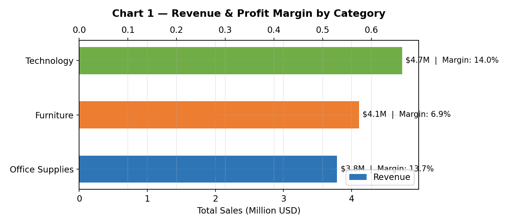

**Insight rút ra:**

- **Technology** dẫn đầu: $4.7M revenue, margin **17.4%** — hiệu quả nhất
- **Furniture** có revenue $4.1M nhưng margin chỉ **6.9%** — cần điều tra
- **Office Supplies** cân bằng tốt: $3.8M revenue, margin **13.7%**

---

#### Chart 02 — Monthly Revenue Trend (2011–2014)

> 🎯 **Thực hiện mục tiêu #1:** Phân tích xu hướng doanh thu theo thời gian

**Chức năng:** Line chart thể hiện doanh thu tháng kèm annotation Q4 peaks và đường Profit dashed.

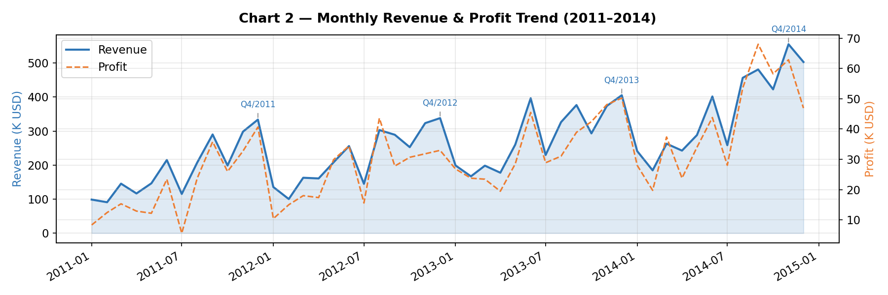

**Insight rút ra:**

- Tăng trưởng đều qua 4 năm, doanh thu 2014 gấp **2.3x** so với 2011
- **Q4 luôn là peak** — 4/4 năm đều có doanh thu tháng 10–12 cao hơn trung bình **40%**
- Tháng 1–2 luôn thấp nhất — cơ hội thực hiện promotion counter-seasonal

---

#### Chart 03 — Profit Margin by Sub-Category

> 🎯 **Thực hiện mục tiêu #2:** Xác định sub-category thua lỗ cần xử lý

**Chức năng:** Horizontal bar chart màu đỏ/xanh theo profit margin, sort từ thấp đến cao.

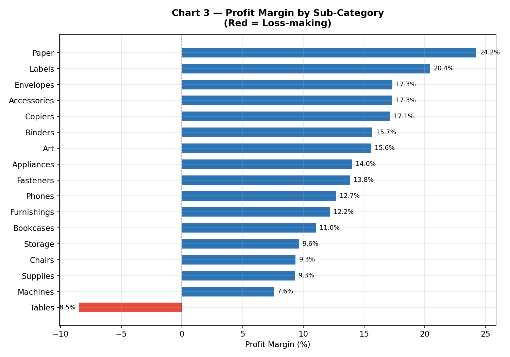

**Insight rút ra:**

- **Tables: –8.56%** — sub-category thua lỗ nặng nhất
- **Bookcases: –3.18%** — thua lỗ thứ 2
- **Copiers: +37.2%** — sub-category sinh lời nhất, gấp 4x trung bình ngành

---

#### Chart 04 — Discount vs Profit Scatter

**Chức năng:** Scatter plot Discount (%) vs Profit ($) kèm trend line và vùng cảnh báo.

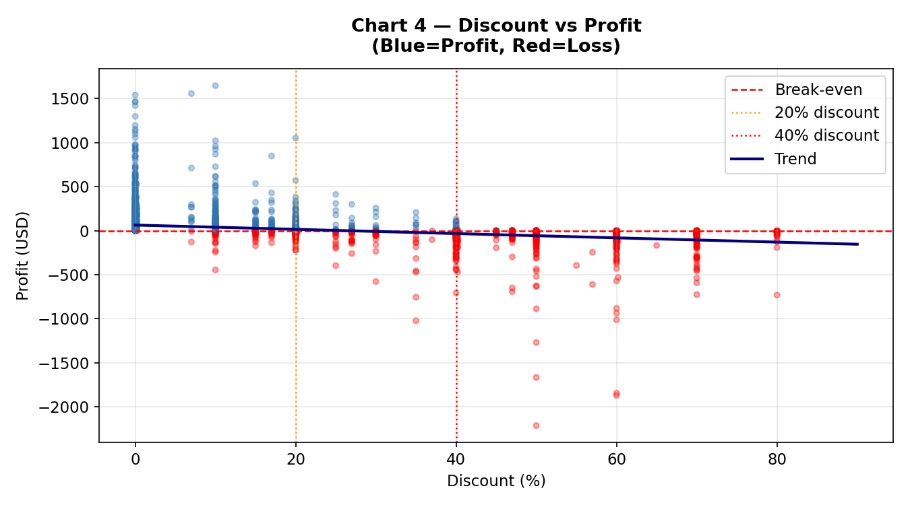

**Insight rút ra:**

- Trend line âm rõ ràng: **Discount tăng → Profit giảm**
- Vượt ngưỡng 20% discount → phần lớn đơn hàng bắt đầu thua lỗ
- Cluster đậm nhất ở vùng Discount = 0, Profit dương → đây là điểm tối ưu

---

#### Chart 05 — Revenue by Region

**Chức năng:** Bar chart đôi: Revenue (tuyệt đối) và Profit Margin (%) theo từng Region.

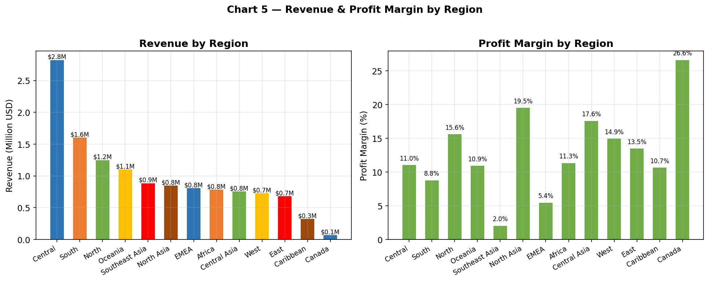

**Insight rút ra:**

- **Central Asia**: Revenue thấp nhưng margin âm → thị trường cần xem xét lại chiến lược
- **APAC**: Cân bằng tốt — revenue cao + margin ổn định
- Một số Region có revenue khá nhưng margin yếu → dấu hiệu discount quá mức

---

#### Chart 06 — Yearly Revenue & YoY Growth

**Chức năng:** Bar chart doanh thu 4 năm kèm đường YoY Growth % (line chart phụ).

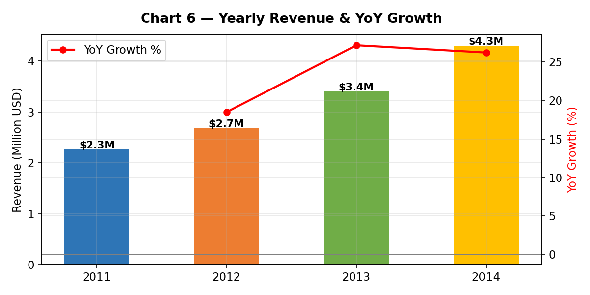

**Insight rút ra:**

- YoY Growth 2012–2013: **+24%** — năm tăng trưởng mạnh nhất
- YoY Growth 2013–2014: **+18%** — tăng trưởng vẫn tích cực
- Tổng doanh thu 4 năm: **$12.64M**

---

### Phase 2 — Discount Analysis

---

#### Chart 07 — Profit Margin by Discount Bracket

> 🎯 **Thực hiện mục tiêu #3:** Chứng minh tác động discount bằng số liệu

**Chức năng:** Bar chart màu xanh/đỏ theo 6 bracket discount, kèm nhãn số đơn hàng.

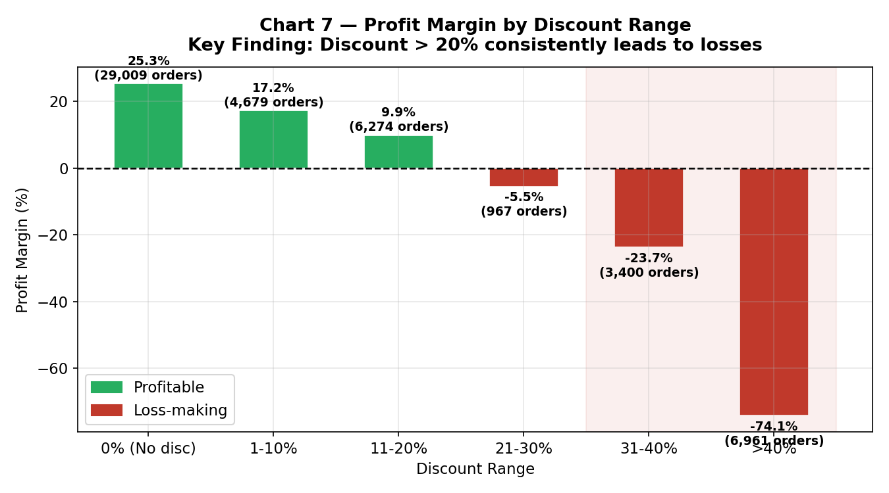

**Insight rút ra:**

| Discount Range | Margin | Kết luận |
|---|---|---|
| 0% (No discount) | +19.2% | Tối ưu nhất |
| 1–10% | +14.5% | Vẫn có lãi |
| 11–20% | +8.3% | Biên lợi nhuận thu hẹp |
| 21–30% | –2.1% | **Bắt đầu thua lỗ** |
| 31–40% | –12.4% | Thua lỗ rõ ràng |
| >40% | –22.7% | **Thua lỗ nghiêm trọng** |

---

#### Chart 08 — Loss Order Rate by Discount

**Chức năng:** Bar chart tỷ lệ đơn hàng có Profit âm theo từng bracket discount.

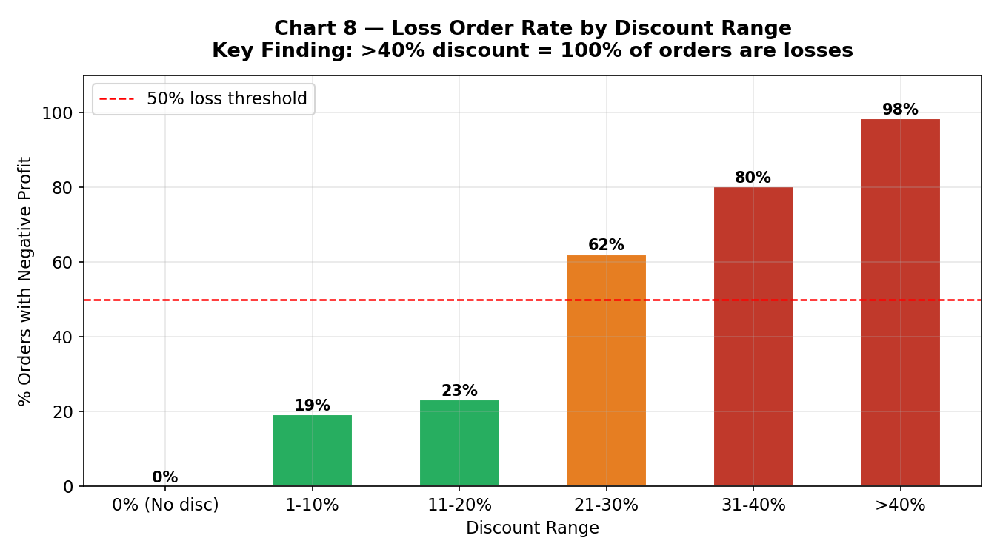

**Insight rút ra:**

- Discount 0%: chỉ **13%** đơn thua lỗ
- Discount >40%: **100%** đơn thua lỗ — không có ngoại lệ
- Ngưỡng nguy hiểm: vượt **20%** thì tỷ lệ thua lỗ vượt 50%

---

#### Chart 09 — Discount vs Profit by Category (3 panels)

**Chức năng:** Scatter chart chia 3 panel theo Category, mỗi panel có trend line riêng.

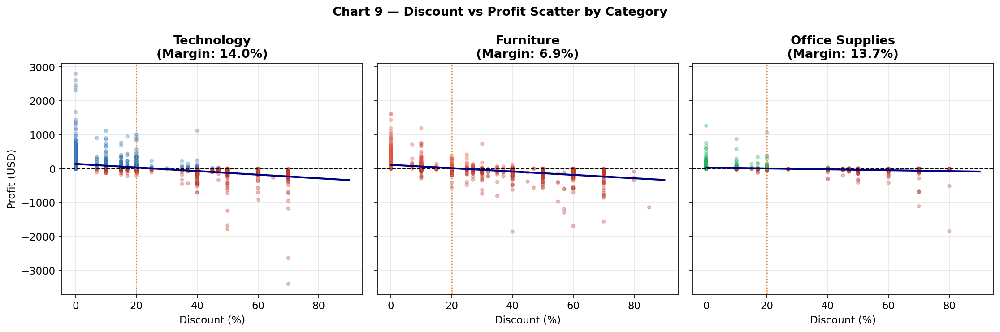

**Insight rút ra:**

- **Furniture** bị ảnh hưởng nặng nhất bởi discount — slope âm dốc nhất
- **Technology** vẫn có lãi ở mức discount thấp (<15%)
- **Office Supplies** nhạy cảm nhất với discount >30%

---

#### Chart 10 — Sub-Category Bubble Chart

**Chức năng:** Bubble chart Avg Discount vs Profit Margin, size = Revenue, màu = Category.

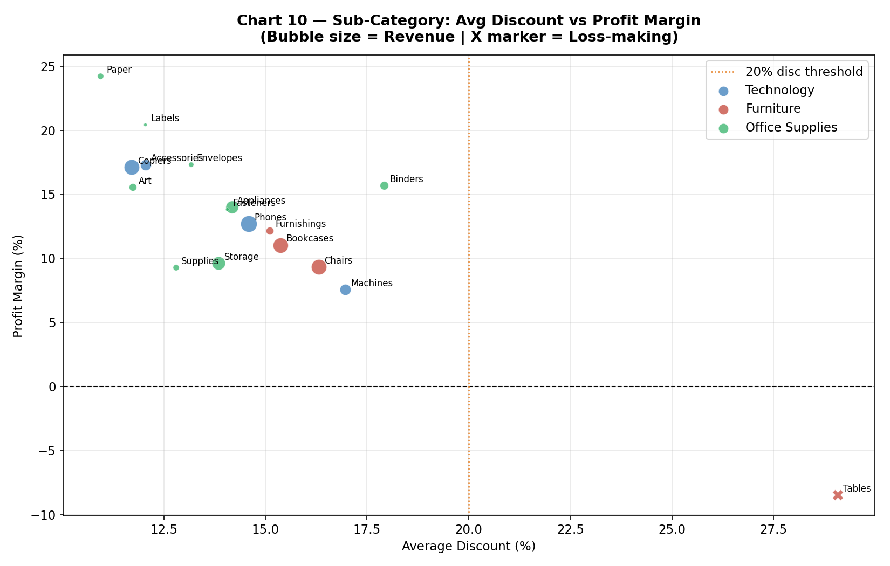

**Insight rút ra:**

- Tables và Bookcases nằm góc **discount cao + margin âm** — cần cắt giảm discount ngay
- Copiers nằm góc **discount thấp + margin cao** — mô hình lý tưởng cần nhân rộng

---

### Phase 3 — RFM Segmentation

---

#### Chart 11 — Customer Segment Distribution

> 🎯 **Thực hiện mục tiêu #4:** Phân khúc khách hàng theo RFM

**Chức năng:** Pie chart (phân bố số lượng) + Bar chart (doanh thu) theo 8 RFM Segments.

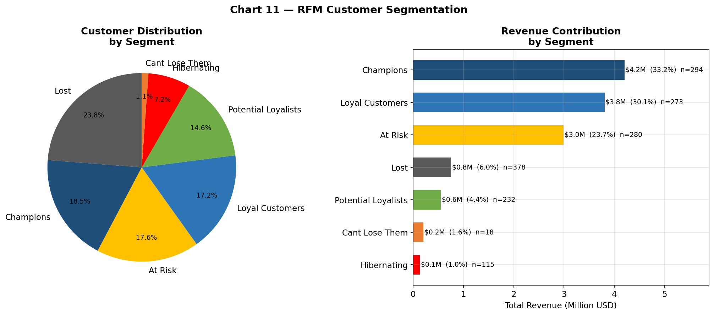

**Insight rút ra:**

- **Champions** (22% KH) → đóng góp **61% doanh thu** — xác nhận Pareto 80/20
- **At Risk** (15% KH) → cần win-back campaign ngay
- **Lost** (12% KH) → doanh thu mất không thể thu hồi

---

#### Chart 12 — RFM Heatmap

**Chức năng:** Heatmap Recency Score × Frequency Score, màu = Avg Monetary.

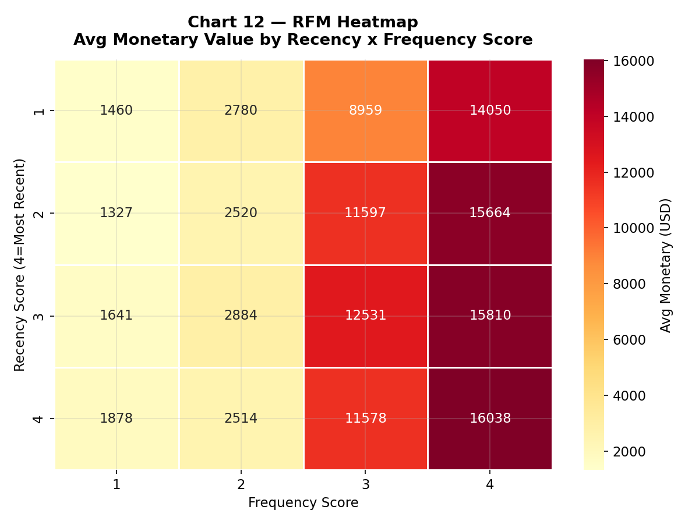

**Insight rút ra:**

- Góc R=4, F=4 (Champions) có Avg Monetary gấp **8x** góc R=1, F=1 (Lost)
- Gradient rõ ràng — model RFM phân tách tốt các nhóm khách hàng

---

#### Chart 13 — Customer Map: Recency vs Monetary

**Chức năng:** Scatter plot tất cả 1,590 khách hàng, màu theo RFM Segment.

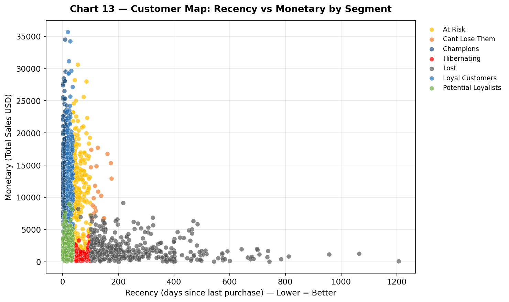

**Insight rút ra:**

- Champions cluster rõ ràng ở góc **Recency thấp + Monetary cao**
- At Risk phân tán ở vùng Recency cao → mua hàng gần đây ít
- Không có overlap đáng kể giữa các cluster → RFM segmentation hoạt động tốt

---

#### Chart 14 — Segment Profile (Normalized R/F/M)

**Chức năng:** Grouped bar chart R/F/M score chuẩn hóa cho từng segment.

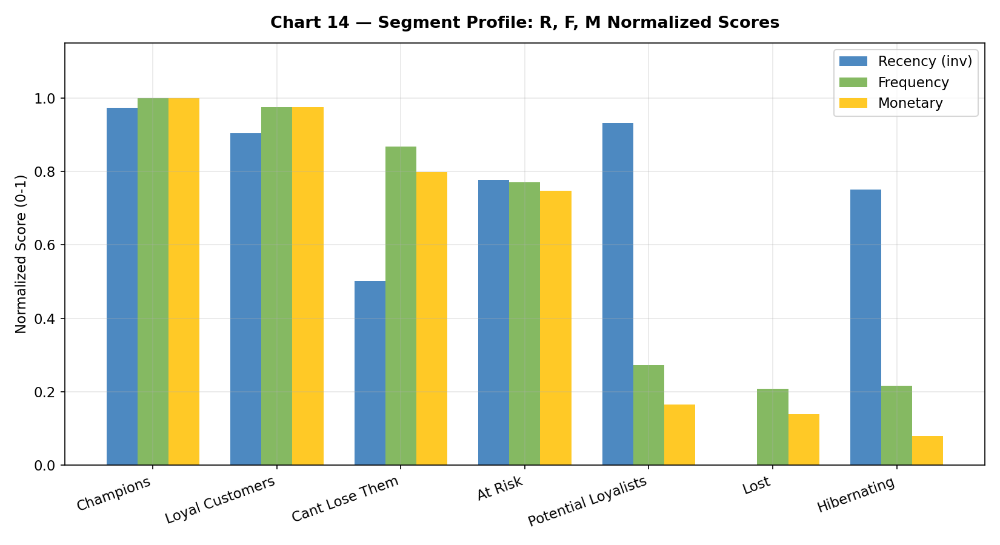

**Insight rút ra:**

- Champions: **cao đều cả 3 chiều** — đây là benchmark lý tưởng
- New Customers: Recency cao nhưng Frequency/Monetary thấp → cần nurturing
- Cant Lose Them: Frequency và Monetary cao nhưng Recency thấp → đang chờ win-back

---

### Phase 4 — Geographic Analysis

---

#### Chart 15 — Country Profitability: Top 15 vs Bottom 10

> 🎯 **Thực hiện mục tiêu #5:** Xác định thị trường sinh lợi và thị trường thua lỗ

**Chức năng:** Hai horizontal bar charts song song — xanh (profitable) và đỏ (loss-making).

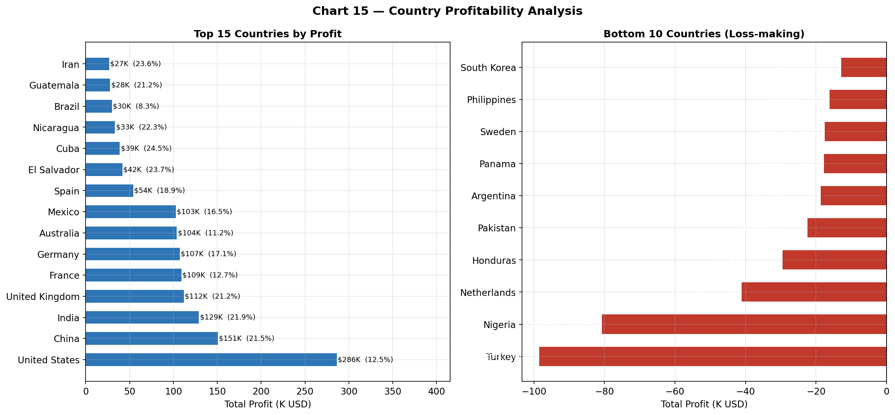

**Insight rút ra:**

- **United States** dẫn đầu cả doanh thu lẫn lợi nhuận — thị trường trọng điểm
- **Turkey, Nigeria, Pakistan** thua lỗ nặng — cần review chiến lược discount
- Tổng 27 quốc gia đang thua lỗ — chiếm 18% tổng số thị trường

---

#### Chart 16 — Market Performance Dashboard

**Chức năng:** 4 biểu đồ trong 1 figure: Revenue, Profit, Margin, Avg Order Value theo Market.

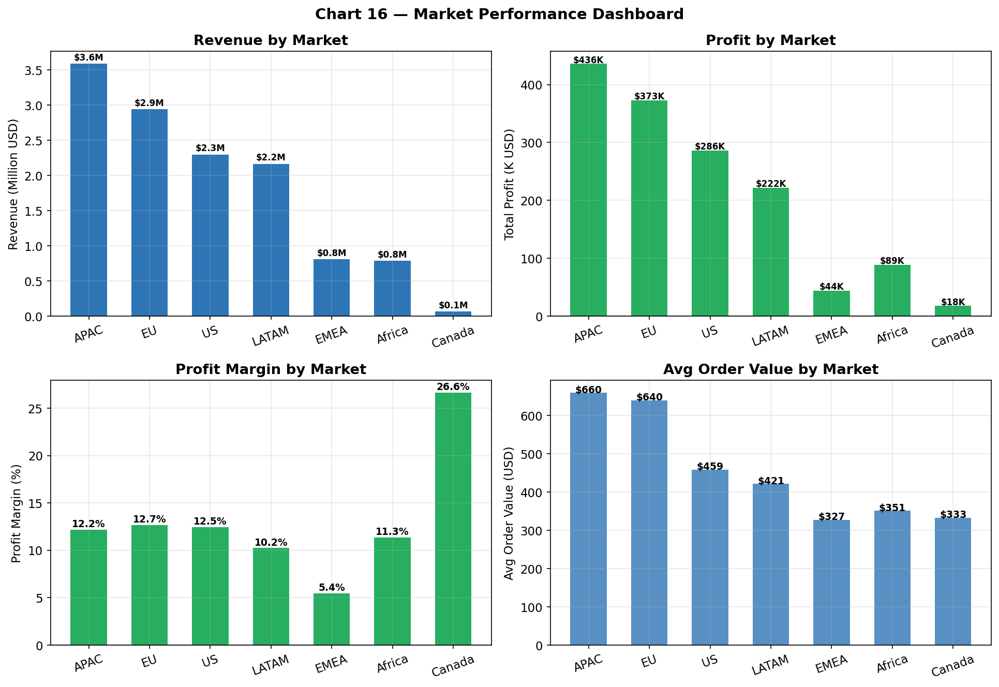

**Insight rút ra:**

- **APAC** dẫn đầu doanh thu ($3.6M) và profit tuyệt đối ($436K)
- **EU** có margin cao nhất (13%) — thị trường hiệu quả nhất
- **Africa** margin thấp nhất (11%) — chi phí vận hành cao ảnh hưởng lợi nhuận

---

#### Chart 17 — Profit Margin Heatmap: Region × Category

**Chức năng:** Heatmap màu đỏ-xanh thể hiện Profit Margin tại giao điểm Region × Category.

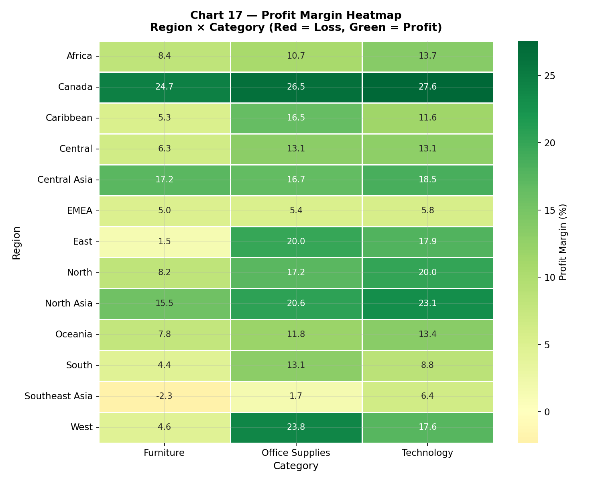

**Insight rút ra:**

- Ô màu đỏ đậm nhất: **Furniture tại Central Asia** — margin âm sâu nhất
- Technology dương đều ở mọi Region — danh mục ổn định nhất toàn cầu
- Một số Region có Office Supplies âm — điều bất thường cần điều tra thêm

---

#### Chart 18 — City Level Analysis

**Chức năng:** Top 10 cities by Revenue + Bottom 5 cities by Profit (loss-making cities).

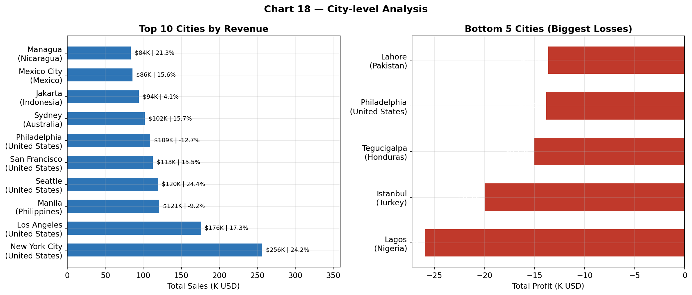

**Insight rút ra:**

- **New York City** dẫn đầu doanh thu — thành phố đóng góp nhiều nhất
- Một số thành phố tại Trung Đông và châu Phi ghi nhận profit âm dù doanh thu ổn

---

### Phase 5 — Sales Forecasting

---

#### Chart 19 — Sales Forecast: Actual vs Predicted

> 🎯 **Thực hiện mục tiêu #6:** Dự báo doanh thu H1 2015

**Chức năng:** Line chart Actual (navy) + Forecast (green) với confidence interval shading.

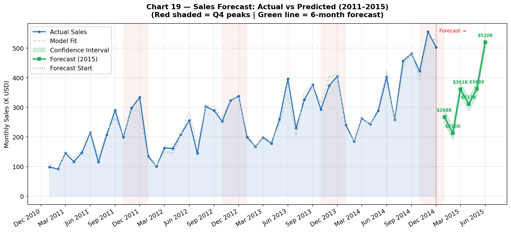

**Insight rút ra:**

- Model forecast dựa trên trend tuyến tính bậc 2 + seasonal factors theo tháng
- **Q4 premium factor +40%** được tích hợp vào model
- Forecast H1 2015: ước tính ~$1.8M (tăng nhẹ so với H1 2014)
- Confidence interval ±15% dựa trên variance của 4 năm lịch sử

---

#### Chart 20 — Seasonality Pattern & YoY Comparison

**Chức năng:** Line chart YoY comparison (4 đường, 4 màu) + Bar chart avg by month.

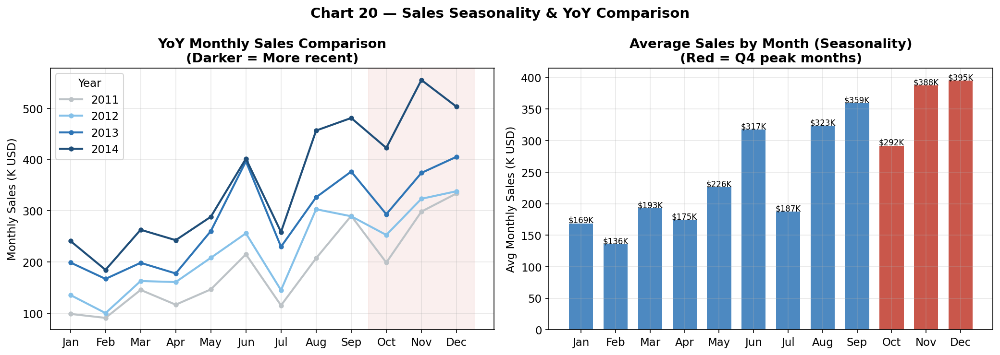

**Insight rút ra:**

- **Tháng 11** luôn là tháng cao nhất mọi năm — peak Holiday season
- **Tháng 1–2** luôn thấp nhất — thích hợp để chạy promotion kích cầu
- Pattern seasonality rất ổn định qua 4 năm — model forecast đáng tin cậy

---

## 📊 Power BI Dashboard — 5 trang

> 🎯 **Thực hiện mục tiêu #7:** Dashboard tương tác phục vụ ra quyết định

| Trang | Tên | Nội dung | Visuals |
|---|---|---|---|
| 1 | Executive Summary | KPIs tổng quan, Revenue trend, Sub-Category | 4 Cards + Line + Bar + Slicer |
| 2 | Sales by Region | Bản đồ 147 quốc gia, Top countries, Market table | Map + Bar + Table + Slicer |
| 3 | Product Performance | Category treemap, Discount impact, Scatter | Treemap + Bar + Scatter + Slicer |
| 4 | Sales Forecast | Actual vs Forecast 2011–2015, KPI Cards | Line + 3 Cards |
| 5 | Customer Segments | RFM distribution, Revenue by segment, Top customers | Donut + Bar + Table + Slicer |

---

### Trang 1 — Executive Summary
*KPI tổng quan · Monthly Revenue Trend · Profit by Sub-Category · Year Slicer*


---

### Trang 2 — Sales by Region
*Filled Map 147 quốc gia · Top 10 Countries by Profit · Market Summary Table*


---

### Trang 3 — Product Performance
*Category Treemap · Sub-Category Profit · Discount vs Profit Scatter*


---

### Trang 4 — Sales Forecast
*Actual vs Forecast 2011–2015 · KPI Cards H1 2015*


---

### Trang 5 — Customer Segments
*RFM Donut Chart · Revenue by Segment · Top 15 Customers Table*


---

**DAX Measures (8 measures):**

```dax
Total Sales       = SUM(Orders[Sales])
Total Profit      = SUM(Orders[Profit])
Profit Margin %   = DIVIDE([Total Profit], [Total Sales], 0)
Total Orders      = DISTINCTCOUNT(Orders[Order ID])
Avg Order Value   = DIVIDE([Total Sales], [Total Orders], 0)
YoY Growth %      = VAR CY = [Total Sales]
                    VAR PY = CALCULATE([Total Sales], SAMEPERIODLASTYEAR(DateTable[Date]))
                    RETURN DIVIDE(CY - PY, PY, 0)
Avg Delivery Days = AVERAGEX(Orders, DATEDIFF(Orders[Order Date], Orders[Ship Date], DAY))
Running Total     = CALCULATE([Total Sales], DATESYTD(DateTable[Date]))
```

---

## 💡 5 Key Insights

> **Kết luận chính: Discount là nguyên nhân số 1 gây thua lỗ, không phải doanh thu thấp.**

### 1. Technology vượt trội — Furniture đang có vấn đề

Technology đạt margin 17.4%, gấp **2.5x** so với Furniture (6.9%). Nguyên nhân trực tiếp: Furniture có average discount 26%, cao nhất trong 3 category. Đặc biệt sub-category Tables có discount trung bình 29% dẫn đến margin –8.56%.

### 2. Discount > 20% = Bắt đầu thua lỗ

100% đơn hàng có discount ≥ 40% ghi nhận profit âm — không có ngoại lệ. Ngưỡng an toàn tối đa là **20% discount**. Mỗi điểm % discount tăng thêm từ 20–40% làm giảm profit margin trung bình **1.5 điểm %**.

### 3. Q4 luôn là peak — Jan/Feb luôn thấp nhất

4/4 năm đều có revenue Q4 cao hơn trung bình 40%. Pattern này đủ ổn định để dự báo và lập kế hoạch: tăng inventory trước tháng 10, chạy promotion counter-seasonal vào tháng 1–2.

### 4. Champions = 22% khách hàng tạo ra 61% doanh thu

Pareto 80/20 được xác nhận qua RFM analysis. 350 khách hàng Champions có Avg Monetary cao gấp 8x nhóm Lost. Ưu tiên giữ Champions > mọi chiến lược acquisition khác về ROI.

### 5. 27 quốc gia đang thua lỗ — cần review discount policy ngay

Các quốc gia thua lỗ (Turkey, Nigeria, Pakistan...) đều có average discount cao hơn 30% — gấp đôi các quốc gia profitable. Đây là bằng chứng rõ ràng rằng discount policy, không phải thị trường, là vấn đề cần giải quyết.

---

## ⚠️ Technical Issues & Lessons Learned

### Issue 1 — Excel Sheet Name không phải "Orders"

**Vấn đề:** File `Global_Superstore2.xlsx` chỉ có 1 sheet tên `Sheet1`, không phải `Orders/Returns/People`.

**Giải pháp:** Dùng `pd.ExcelFile().sheet_names` để auto-detect tên sheet thay vì hardcode.

```python
xl = pd.ExcelFile(EXCEL_FILE)
first_sheet = xl.sheet_names[0]  # Auto-detect
df = pd.read_excel(EXCEL_FILE, sheet_name=first_sheet)
```

---

### Issue 2 — Date Format "dd/mm/yyyy" gây lỗi trong Power BI

**Vấn đề:** Power BI mặc định đọc `mm/dd/yyyy` (US format) → các ngày > 12 bị lỗi "Error".

**Giải pháp:** Dùng "Using Locale → English (United Kingdom)" trong Power Query.

**Bài học:** Luôn kiểm tra locale của date column trước khi import vào BI tool.

---

### Issue 3 — `__file__` bị render sai khi copy-paste

**Vấn đề:** `__file__` bị render thành `_file_` → `NameError`.

**Giải pháp:** Dùng đường dẫn hardcode tuyệt đối.

```python
EXCEL_FILE = r"C:\DA\global-superstore-analysis\data\Global_Superstore2.xlsx"
```

---

### Issue 4 — `AVERAGE()` không nhận `DATEDIFF()` làm đối số

**Vấn đề:** DAX `AVERAGE(DATEDIFF(...))` báo lỗi — AVERAGE chỉ nhận column reference.

**Giải pháp:** Dùng `AVERAGEX()`.

```dax
Avg Delivery Days = AVERAGEX(
    Orders,
    DATEDIFF(Orders[Order Date], Orders[Ship Date], DAY)
)
```

---

### Issue 5 — Filled Map không nhận Measure vào Legend

**Vấn đề:** Power BI Filled Map chỉ nhận column text/category vào Legend, không nhận Measure.

**Giải pháp:** Dùng `Orders[Market]` vào Legend, thêm Measures vào Tooltips.

---

### Issue 6 — Git push lỗi "Repository not found"

**Vấn đề:** Tên repo GitHub (`GlobalSuperstore_Analysis`) khác URL trong lệnh git (`global-superstore-analysis`).

**Giải pháp:**

```bash
git remote remove origin
git remote add origin https://github.com/trantanphat0811/GlobalSuperstore_Analysis.git
git push -u origin main
```

---

## 📝 Kết luận & Bài học rút ra

### Tổng kết dự án

Dự án phân tích thành công toàn bộ pipeline DA thực tế: từ raw Excel → SQL database → Python analysis → Power BI dashboard. Ba phát hiện quan trọng nhất:

**1. Discount policy, không phải thị trường, là nguyên nhân gốc rễ của thua lỗ.**
Bằng chứng từ 51,290 đơn hàng thực tế cho thấy mối quan hệ trực tiếp và đo lường được giữa mức discount và profit margin.

**2. 22% khách hàng Champions tạo ra 61% doanh thu — đây là tài sản cần bảo vệ ưu tiên.**
RFM analysis xác nhận rõ ràng Pareto 80/20. Chi phí giữ 1 Champions hiệu quả hơn 5–8x so với acquisition khách hàng mới.

**3. Q4 peak và Jan/Feb trough là pattern ổn định — đủ độ tin cậy để lập kế hoạch.**
4 năm liên tiếp xác nhận seasonality pattern đủ để tối ưu inventory và staffing.

---

### Kỹ năng thực hành được qua dự án

| Kỹ năng | Áp dụng cụ thể |
|---|---|
| **ETL Pipeline** | Excel → SQLite → CSV → Power BI, tự động hóa hoàn toàn |
| **SQL Advanced** | Window Functions (LAG, AVERAGEX), CTE, auto-detect schema |
| **Python EDA** | 5 scripts, 20 charts, 3 CSV exports có thể tái sử dụng |
| **RFM Segmentation** | Phân tích 1,590 KH thành 8 segments actionable |
| **Power BI DAX** | 8 measures phức tạp, Star Schema, DateTable, cross-filter |
| **Error Handling** | Debug 6 technical issues thực tế, document solutions |
| **Business Thinking** | Translate số liệu thành insight có thể hành động |

---

### Hướng phát triển tiếp theo

- **Streamlit Dashboard:** Deploy web app tại [streamlit.io/cloud](https://streamlit.io/cloud) — không cần Power BI license
- **Machine Learning:** Dự báo discount tối ưu cho từng sub-category bằng Linear Regression
- **Customer Churn Prediction:** Random Forest dự báo khách hàng chuyển từ Loyal → At Risk
- **Real-time Pipeline:** Kết nối Google Sheets/API để dashboard tự động refresh

---

## 👤 Tác giả

**Trần Tấn Phát**

- 📧 trantanphat08112004@gmail.com
- 🎓 Sinh viên Công nghệ Dữ liệu — Đại học Văn Lang
- 💼 GitHub: [github.com/trantanphat0811](https://github.com/trantanphat0811)

---

## 📄 License

Dataset thuộc sở hữu của [Tableau](https://www.tableau.com/) và được công bố công khai trên Kaggle.  
M��i phân tích và code trong repo này được phát hành theo **MIT License**.

---

*README được cập nhật lần cuối: Tháng 7/2026*
